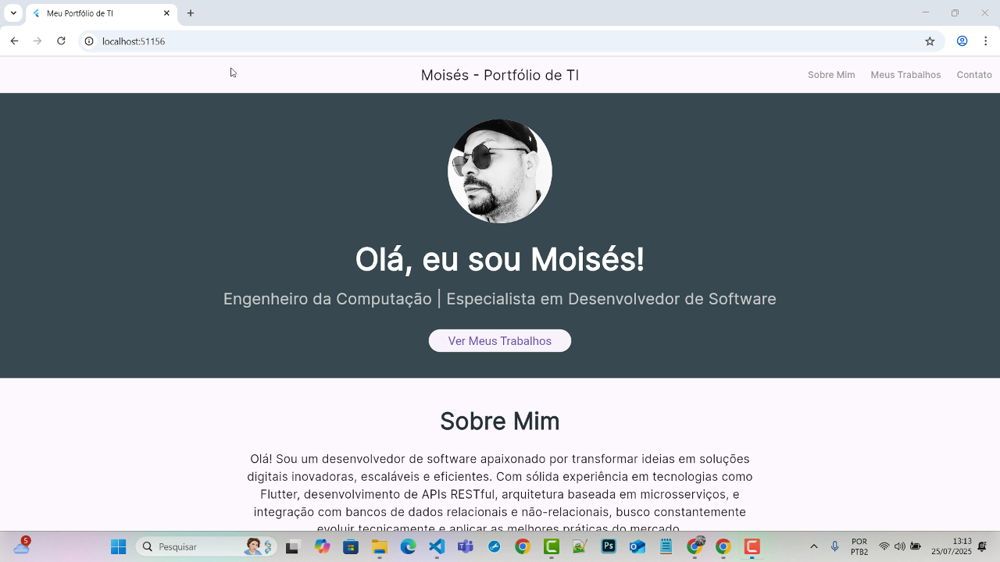
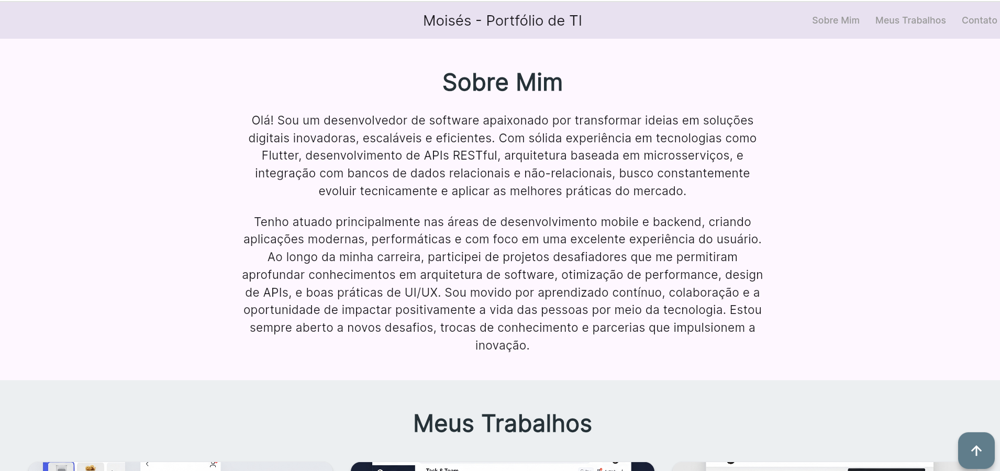
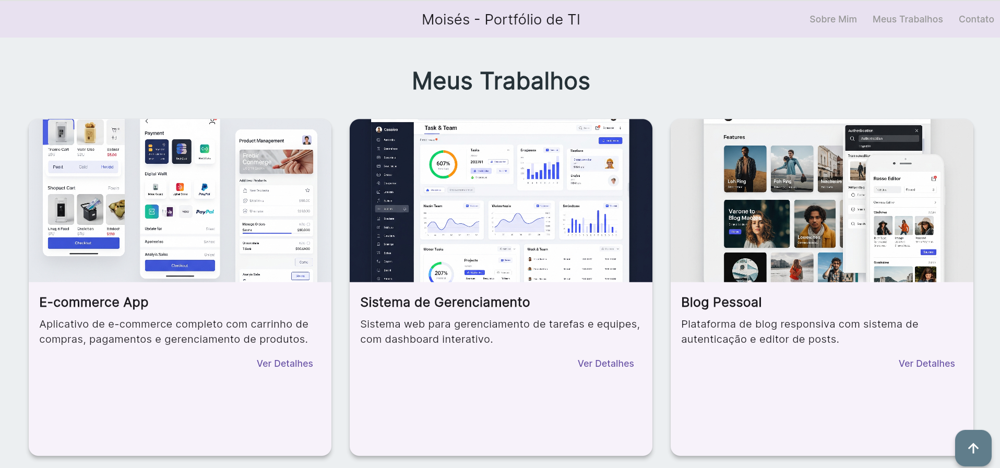
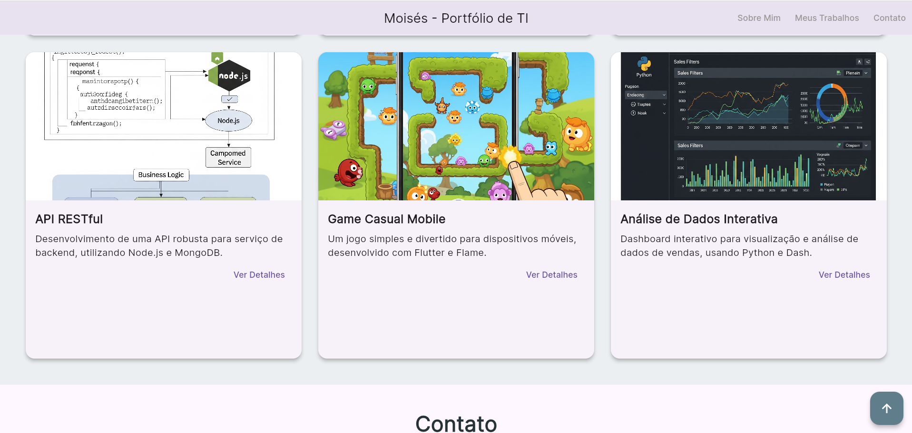
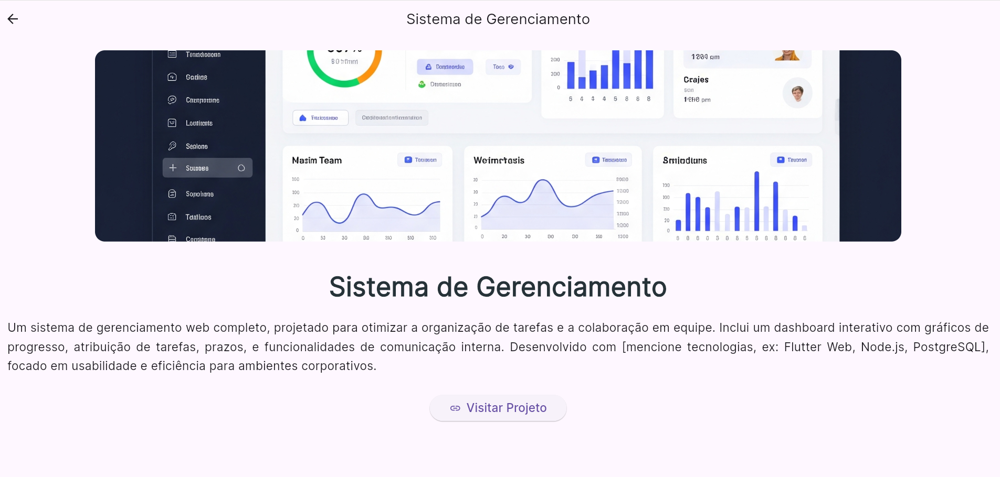
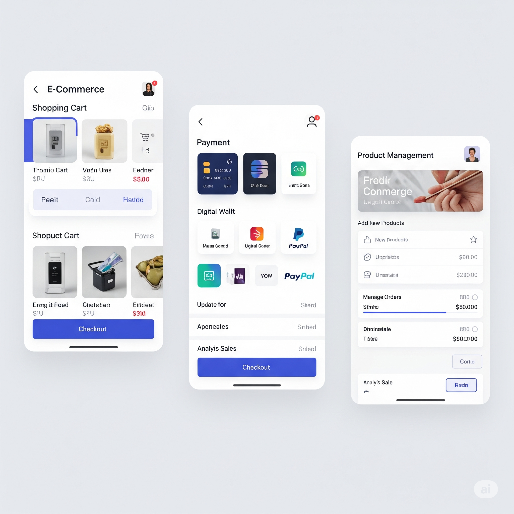
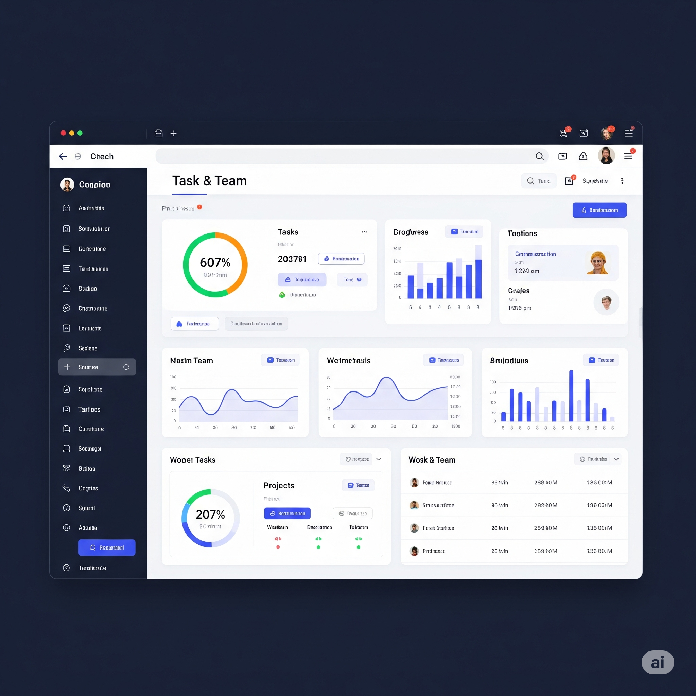
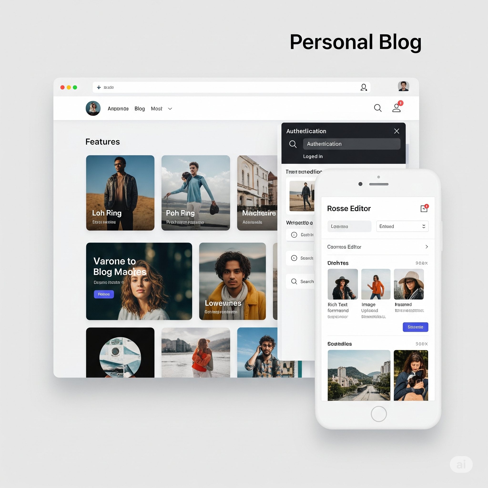
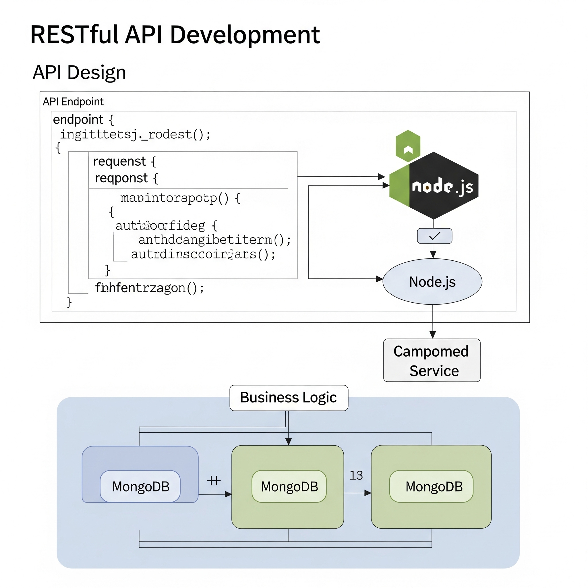
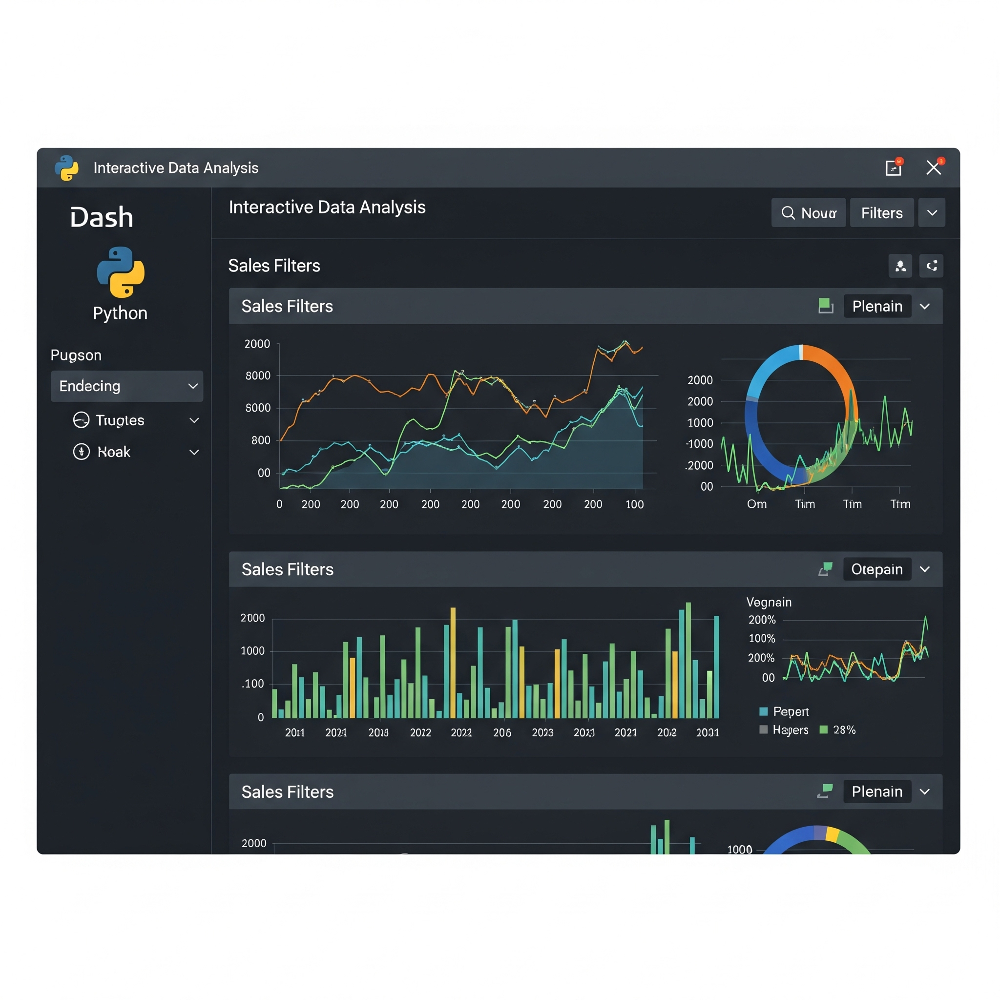

# landpageti

Um novo projeto Flutter.

## Visão Geral do Projeto

Este projeto é um ponto de partida para uma aplicação Flutter, focado em uma landing page interativa.

### Apresentação do Projeto (Vídeo)

Assista a uma breve apresentação do projeto em ação:

<video src="assets/images/apresenta%C3%A7%C3%A3o.mp4" controls title="Apresentação do Projeto"></video>

Você também pode conferir uma versão básica da landing page:

<video src="assets/images/landBasica2025/landBasica2025.mp4" controls title="Landing Page Básica 2025"></video>

### Screenshots e Destaques

Veja algumas telas e destaques do projeto:

#### Seção de Contato
Uma visão geral da seção de contato da sua aplicação.

#### Primeira Visão da Landing Page
A primeira impressão da sua landing page.

#### Segunda Visão da Landing Page
A Segunda impressão da sua landing page.

#### Terceira Visão da Landing Page
A Terceira impressão da sua landing page.

#### Quarta Visão da Landing Page
A Quarta impressão da sua landing page.

#### Quinta Visão da Landing Page
A Quinta impressão da sua landing page.

#### Miniaturas da Landing Page
Uma galeria de miniaturas mostrando diferentes partes da landing page.

#### Galeria de Projetos

Confira exemplos de projetos ou seções específicas da sua landing page:

| Projeto 1 | Projeto 2 | Projeto 3 |
|---|---|---|
|  |  |  |

| Projeto 4 | Projeto 5 | Projeto 6 |
|---|---|---|
|  |  |  |

## Primeiros Passos

Este projeto é um ponto de partida para uma aplicação Flutter.

Alguns recursos para você começar, se este for seu primeiro projeto Flutter:

- [Lab: Write your first Flutter app](https://docs.flutter.dev/get-started/codelab)
- [Cookbook: Useful Flutter samples](https://docs.flutter.dev/cookbook)

Para ajuda para começar com o desenvolvimento Flutter, veja a [documentação online](https://docs.flutter.dev/), que oferece tutoriais, exemplos, orientações sobre desenvolvimento móvel e uma referência completa da API.
